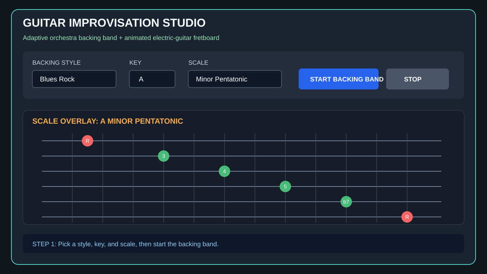
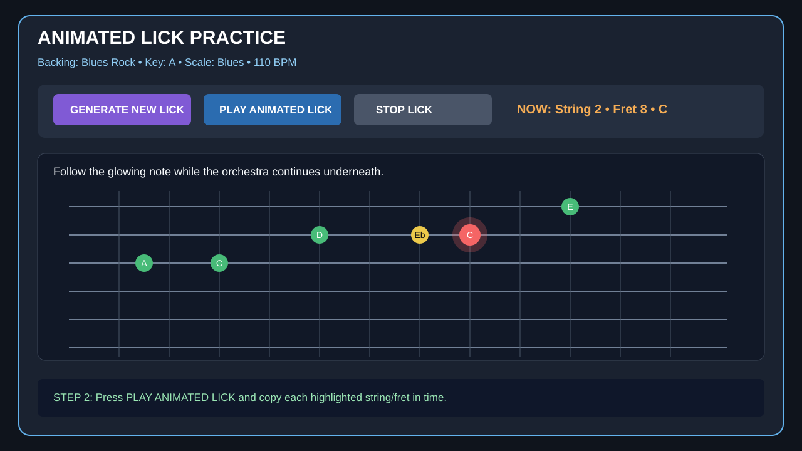

# Guitar Improvisation Studio Demo

This walkthrough demonstrates the guitar-first workflow added to the MIDI DJ application. The screenshots are annotated interface schematics that show the intended JavaFX controls and practice sequence; they are not photographs of a live desktop session.

## Demo goal

Create and practice an eight-note electric-guitar lick over an adaptive MIDI backing band, generate a variation, save the useful phrase, and then improvise freely using the same scale overlay.

## Before starting

Use JDK 21 or newer. From the repository root, launch the primary application with:

```bash
gradle run
```

The Gradle application entry point is:

```text
io.github.rohanpurohit7.mididj.GuitarImprovisationStudioApp
```

The original DJ/orchestra editor remains available from the `OPEN LEGACY DJ BOX` control.

## Step 1 — Select a backing band and scale



1. Choose **Blues Rock** as the backing style.
2. Select **A** as the key.
3. Select **Minor Pentatonic** or **Blues** as the scale.
4. Set the tempo near **105–115 BPM** for a comfortable practice speed.
5. Press **START BACKING BAND**.
6. Confirm that the fretboard displays the selected scale. Root notes should be visually distinct from the other scale tones.

The backing layer is generated with the Java Sound MIDI sequencer. It functions as an adaptive orchestra rather than a fixed copyrighted audio track.

## Step 2 — Generate and follow an animated lick



1. Press **GENERATE NEW LICK**.
2. Review the generated phrase before playing it.
3. Press **PLAY ANIMATED LICK**.
4. Follow the highlighted string and fret while listening to the MIDI guitar phrase.
5. Copy the lick slowly and keep time with the backing band.
6. Stop the lick playback while allowing the backing track to continue, then improvise using nearby highlighted scale notes.

A practical exercise is to alternate four measures of the generated lick with four measures of free improvisation.

## Step 3 — Generate a variation and save useful material


1. Press **GENERATE VARIATION** to transform the current phrase.
2. Play the variation and compare its contour with the original lick.
3. Keep whichever phrase feels more natural under the backing progression.
4. Press **SAVE LICK**.
5. Select a saved lick and use **LOAD SELECTED** to restore it in a later practice session.
6. Continue generating new licks and variations until you have several connected phrases for a complete solo.

Saved licks are stored locally in:

```text
saved-guitar-licks.txt
```

## Suggested five-minute improvisation session

| Time | Activity |
|---|---|
| 0:00–1:00 | Start the backing band and play the full scale overlay slowly |
| 1:00–2:00 | Generate and copy one animated lick |
| 2:00–3:00 | Improvise using only the lick's first four notes |
| 3:00–4:00 | Generate and practice a variation |
| 4:00–5:00 | Save the best phrase and perform a free solo |

## Using the orchestra in a novel way

The orchestra engine is not merely a backup player. It can be used as a responsive musical context:

- Change cultural orchestra profiles to hear the same guitar scale against different rhythmic and melodic environments.
- Use the legacy 16-step grid to remove instruments and create space for the guitar.
- Build call-and-response arrangements where the backing orchestra answers the generated lick.
- Reduce tempo while learning a phrase, then increase it without changing the fretboard overlay.
- Save multiple lick variations for the same backing profile and assemble them into a structured solo.

## DevOps quality gate

The repository workflow `.github/workflows/guitar-improv-devops-gate.yml` runs the following controls:

1. Java 21 and Gradle setup.
2. Clean compile of both the guitar studio and legacy DJ app.
3. JUnit tests for scale intervals, fretboard overlays, lick generation and variation behavior.
4. Validation of the primary and legacy application entry points.
5. Validation that this walkthrough and all three screenshot assets exist.
6. A basic committed-secret scan.
7. Verification that saved licks remain local rather than being uploaded to an external service.
8. A final release gate that runs only after the test and documentation jobs pass.

Run the workflow manually from GitHub Actions using **Guitar Improvisation DevOps Gate**, or trigger it by pushing to `master`.
