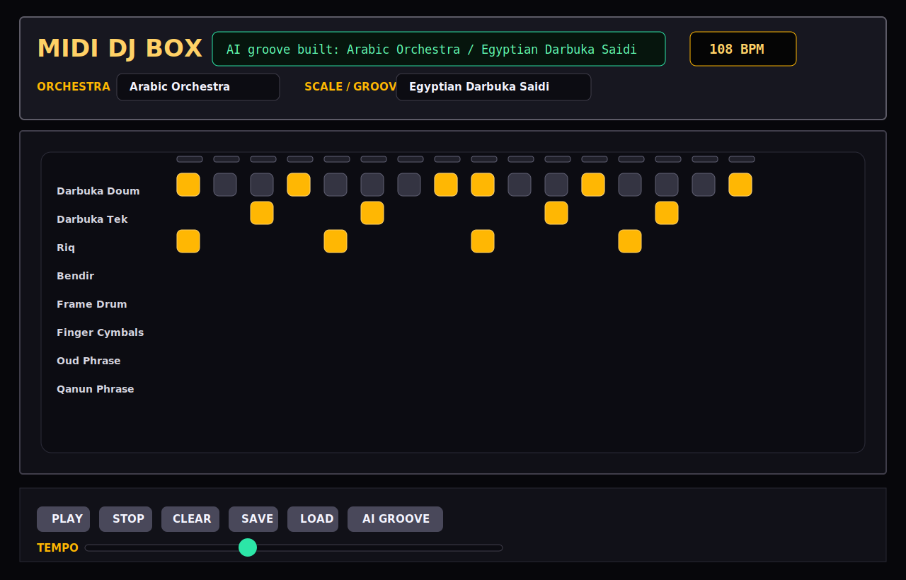
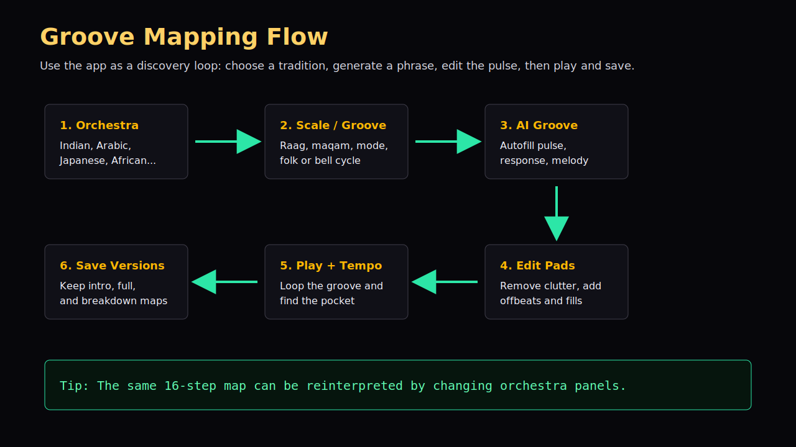

# MIDI DJ Box Musician and DJ Playbook

This playbook is for musicians, producers, and DJ enthusiasts who want to use MIDI DJ Box as a groove-mapping sketchpad. The app is not trying to replace a full DAW. It is a fast way to discover rhythmic skeletons, compare cultural pulse ideas, and turn a scale or drum-cycle preset into a playable 16-step MIDI pattern.

## Quick Start

1. Launch the app with `run-midi-djbox.bat`.
2. Pick an **ORCHESTRA** such as Indian, Arabic, Japanese, Mexican, or African.
3. Pick a **SCALE / GROOVE** such as Raag Yaman, Maqam Hijaz, Egyptian Darbuka Saidi, or Adowa Bell Cycle.
4. Press **AI GROOVE** to populate the grid.
5. Press **PLAY** and listen to the loop.
6. Add or remove steps by clicking pads.
7. Move **TEMPO** until the loop sits in the pocket.
8. Press **SAVE** when you want to keep the current 16-step pattern.

## How To Read The Grid

The grid is a 16-step loop. Read it from left to right.

- Rows 1-6 are the primary pulse and hand-percussion layer.
- Rows 7-16 add melodic, bell, accent, or call-and-response material.
- Bright pads are active MIDI hits.
- The lights above the columns show the playhead while playback is running.

Think of the grid as a rhythm map. The goal is not to fill every square. The strongest grooves usually leave space, then use accents and response hits to create motion.

## Groove Mapping Workflow

### 1. Start With A Culture

Choose a cultural orchestra to change the 16 row labels and their MIDI mappings. Java Sound uses General MIDI, so the app maps named instruments to close MIDI percussion and melodic sounds. Treat the names as musical roles: tabla low, darbuka tek, djembe slap, taiko low, palmas, or cowbell.

### 2. Pick A Scale Or Cycle

The **SCALE / GROOVE** dropdown selects the logic for the AI groove builder. Some presets are scale-oriented, such as Indian raags or Japanese modes. Others are rhythm-cycle oriented, such as Egyptian Darbuka Saidi, Maqsum Baladi, or African bell-cycle patterns.

### 3. Press AI GROOVE

The AI builder fills the grid with:

- Downbeat anchors
- Response accents
- Repeating pulse rows
- Melodic guide notes derived from the selected scale or mode
- Culture-specific accents, such as Arabic darbuka hits or African bell cycles

### 4. Edit Like A DJ

After generation, remove clutter before adding more notes. A practical DJ workflow is:

1. Mute busy rows by clearing a few pads.
2. Keep the strongest low drum accents.
3. Add a shaker, clap, or bell on offbeats.
4. Move tempo in small steps.
5. Save versions after each good variation.

## Culture Preset Ideas

### Indian

Use **Indian Orchestra + Raag Yaman** for a bright melodic sketch. Keep Tabla Bayan on steps 1, 5, 9, and 13, then add Tabla Dayan responses between those anchors. Use the melodic rows as a guide for sitar, bansuri, or harmonium phrasing in another MIDI tool.

### Arabic

Use **Arabic Orchestra + Egyptian Darbuka Saidi** for a heavier dance pulse. The low darbuka row acts like the doum, while the tek and riq rows add response. Use **Maqsum Baladi** when you want a more compact groove that can sit under oud, qanun, or nay phrases.

### Japanese

Use **Japanese Orchestra + In Sen Mode** for sparse tension. Keep the taiko rows simple and let the melodic rows breathe. This is useful for cinematic transitions, intro sections, and breakdowns.

### African

Use **African Orchestra + Adowa Bell Cycle** to explore interlocking pulse. The bell and clave rows are the guide. Try removing bass hits until the pattern feels lighter, then add djembe slap accents back in.

### Spanish And Mexican

Use **Spanish Orchestra + Phrygian Dominant** for flamenco-like tension. Use **Mexican Orchestra + Son Jarocho** for a brighter, danceable grid. In both cases, claps and strums matter more than dense kick/snare thinking.

## Demo Pattern Files

The `docs/demos/` folder includes starter patterns:

- `indian-raag-yaman.txt`
- `arabic-saidi.txt`
- `african-bell-cycle.txt`

To audition one:

1. Copy the demo pattern content into `midi-djbox-pattern.txt` in the project root.
2. Launch the app.
3. Pick the matching orchestra and scale/groove.
4. Press **LOAD**.
5. Press **PLAY**.

The app saves only the 16-step on/off state. The orchestra and scale dropdowns are still chosen live, so the same pattern can be reinterpreted through different instrument panels.

## Practice Exercises

### Exercise 1: Build A Four-Bar DJ Intro

1. Generate an AI groove.
2. Clear all melodic rows except one phrase row.
3. Save that as your intro pattern.
4. Add two more percussion rows.
5. Save again as your full pattern.

### Exercise 2: Discover A New Accent

1. Pick an orchestra you do not normally use.
2. Press **AI GROOVE**.
3. Move only one accent row by toggling pads.
4. Listen for a new offbeat, pickup, or turnaround idea.

### Exercise 3: Cross-Culture Remap

1. Generate **Arabic Orchestra + Maqsum Baladi**.
2. Switch to **African Orchestra** without clearing.
3. Listen to how the same grid changes role.
4. Save the remapped version if it creates a useful groove.

## Notes For Producers

MIDI DJ Box is best used at the sketch stage. Use it to find pulse, density, and accent structure. Once a groove feels good, recreate or record the idea in a DAW with higher quality instrument libraries.

The cultural names are creative mappings over General MIDI, not sampled authentic instruments. Use the patterns as study prompts and arrangement ideas, then refine with real performance knowledge, collaborators, or dedicated sample libraries.
